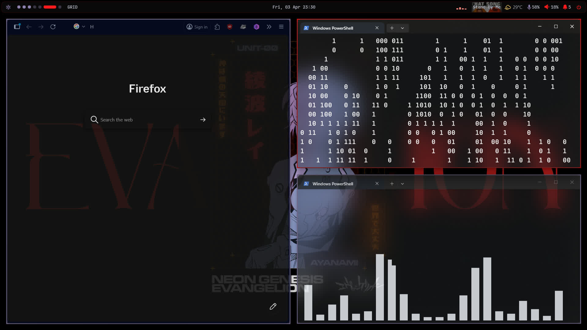

# dotfiles

Configuration files for my Windows setup. Achieved by changing config files for Windows utilities such as PowerShell, and relying on tools such as yasb, komorebi, Windhawk and Powertoys.

## Tools

| Tool | Purpose |
|---|---|
| [komorebi](https://github.com/LGUG2Z/komorebi) | Tiling window manager |
| [yasb](https://github.com/amnweb/yasb) | Status bar |
| [Windows Terminal](https://github.com/microsoft/terminal) | Terminal emulator |
| [Windhawk](https://windhawk.net) | UI mods |
| [Powertoys](https://github.com/microsoft/powertoys) | Utilities to improve productivity |

---

## Themes

### 🔴 Red Theme — Neon Genesis Evangelion
> *Inspired by the UI of NERV's Magi system 

**Palette**
| Role | Color |
|---|---|
| Accent / Focus border | `#ff1a1d` — EVA Red |
| Secondary accent | `#9180b0` — Rei Lilac |
| Hover / Salmon | `#f5857c` — UI Salmon |
| Background | `#0a0a0a` |
| Surface | `#1a1a1a` |

[Red Theme Showcase](https://drive.google.com/file/d/1wJG70yX3vMd8zK2VuswqPhoM9IWZWs8R/view?usp=sharing)

[Setup Guide](./themes/red_theme/setup/setup.md)

---

